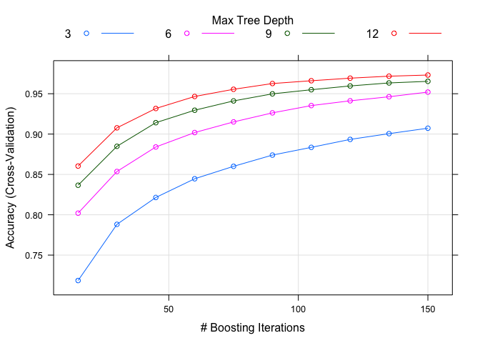

# Practical Machine Learning - Prediction Assignment Writeup
A. Reijs  
21 November 2015  

## Introduction

In this analysis we're going to look at accelerometer data of 6 different individuals performing the Unilateral Dumbbell Biceps Curl. They were asked to perform one set of 10 repetitions in five different fashions: exactly according to the specification (Class A), throwing the elbows to the front (Class B), lifting the dumbbell only halfway (Class C), lowering the dumbbell only halfway (Class D) and throwing the hips to the front (Class E). The goal is to use the accelerometer data to build a model capable of predicting the correct class with high accuracy.
  
Full credits and many thanks go to:  
  
Velloso, E.; Bulling, A.; Gellersen, H.; Ugulino, W.; Fuks, H. Qualitative Activity Recognition of Weight Lifting Exercises. Proceedings of 4th International Conference in Cooperation with SIGCHI (Augmented Human '13) . Stuttgart, Germany: ACM SIGCHI, 2013.  
  
http://groupware.les.inf.puc-rio.br/har#sbia_paper_section  
http://groupware.les.inf.puc-rio.br/public/papers/2013.Velloso.QAR-WLE.pdf


## Setting up

We're going to need data, so let's download it to our working directory.


```r
if (!file.exists("./pml-training.csv"))
    download.file("https://d396qusza40orc.cloudfront.net/predmachlearn/pml-training.csv",
                  "./pml-training.csv",
                  method = "curl")
```

Of course we need lots of different packages, so let's load them up. We're also setting a seed for maximum reproducability.


```r
library(caret); library(survival); library(splines);
library(parallel); library(plyr); library(gbm)
set.seed(1230)
```

## Data preparation

Let's start with loading our raw training dataset. Next, we're going to need an unbiased way of getting an out of sample error rate once our model is done. We will accomplish this by splitting our raw training dataset into a seperate training and validation set. Since we are looking at accelerometer data, we'll want to use only the raw x, y and z measurement data, so we select only the relevant columns (including our `classe` column).


```r
rawTrainData <- read.csv("./pml-training.csv")
inTrain <- createDataPartition(rawTrainData$classe, p = .75, list = FALSE)

trainData <- rawTrainData[inTrain, ]
trainDataXYZ <- trainData[, grep("(classe|_x|_y|_z)$", names(trainData))]

validationData <- rawTrainData[-inTrain, ]
validationDataXYZ <- validationData[, grep("(classe|_x|_y|_z)$", names(validationData))]
```

## Making the model

In this analysis we're going to use a standard cross-validation with 5 folds. The `trainControl` method will take care of that for us. We will be using a Stochastic Gradient Boosting algorithm, a.k.a. boosted tree model (`caret method: gbm`). To get the best result, let's tweak the paramaters a bit. We will be using an interaction depth of 3, 6, 9 and 12 and 150 boost iterations.


```r
trainControl <- trainControl(method = "cv", number = 5)

gbmGrid <-  expand.grid(interaction.depth = c(3, 6, 9, 12),
                        n.trees = (1:10)*15,
                        shrinkage = 0.1,
                        n.minobsinnode = 20)

fit <- train(classe ~ .,
             data = trainDataXYZ,
             trControl = trainControl,
             verbose = FALSE,
             method = "gbm",
             tuneGrid = gbmGrid)
```

Let's take a look at our model `fit` using a standard plot. We can note that an interaction depth of 12 only yields a small improvement over 9, so adding more trees would not do much. The number of boost iterations also seems to be reasonable at 150.


```r
plot(fit)
```

 

## Validating the model

Now let's put our model to the test a bit more. The validation data we've prepared before will now come in handy. Since it has not been used to create our model, we can use it to get an unbiased estimation of the out of sample error rate of our model. Let's do this by taking a sample of half of our validation set with replacement, then make a prediction using our model and finally make a confusion matrix in order to get our accuracy. We will be doing this 25 times using different samples, then show a summary of the accuracies. 


```r
accuracies <- numeric()
iterations <- 25

for (i in 1:iterations) { 
    rows <- nrow(validationDataXYZ)
    sampleDataXYZ <- validationDataXYZ[sample(rows, rows / 2,replace = TRUE), ]    
    predict <- predict(fit, sampleDataXYZ[, -grep("^classe$", names(sampleDataXYZ))])
    matrix <- confusionMatrix(table(predict, sampleDataXYZ$classe))
    accuracies <- c(accuracies, matrix$overall[1])
}

summary(accuracies)
```

```
##    Min. 1st Qu.  Median    Mean 3rd Qu.    Max. 
##  0.9698  0.9759  0.9772  0.9774  0.9792  0.9833
```

Let's also output the matrix of the last iteration to get a sense of the numbers.


```r
matrix
```

```
## Confusion Matrix and Statistics
## 
##        
## predict   A   B   C   D   E
##       A 679   7   1   4   0
##       B   2 455  10   1   0
##       C   3   4 422  11   1
##       D   1   0   6 397   4
##       E   0   4   0   0 440
## 
## Overall Statistics
##                                           
##                Accuracy : 0.9759          
##                  95% CI : (0.9691, 0.9816)
##     No Information Rate : 0.2794          
##     P-Value [Acc > NIR] : < 2.2e-16       
##                                           
##                   Kappa : 0.9696          
##  Mcnemar's Test P-Value : NA              
## 
## Statistics by Class:
## 
##                      Class: A Class: B Class: C Class: D Class: E
## Sensitivity            0.9912   0.9681   0.9613   0.9613   0.9888
## Specificity            0.9932   0.9934   0.9906   0.9946   0.9980
## Pos Pred Value         0.9826   0.9722   0.9569   0.9730   0.9910
## Neg Pred Value         0.9966   0.9924   0.9915   0.9922   0.9975
## Prevalence             0.2794   0.1917   0.1790   0.1684   0.1815
## Detection Rate         0.2769   0.1856   0.1721   0.1619   0.1794
## Detection Prevalence   0.2818   0.1909   0.1799   0.1664   0.1811
## Balanced Accuracy      0.9922   0.9808   0.9759   0.9779   0.9934
```
